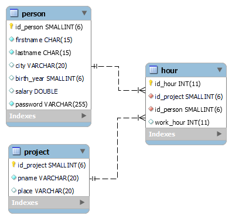

# project-api
This is an example about .NET 6.0 WebApi. The application is made based on MVC-model. There is one Controller which is named PersonController and a model which is named Person.

## ER Model

## Database connection
For development (local machine) I created environment variable called "DATABASE_URL" in Program.cs. I use that variable 
in Database.cs. For production environment (example Heroku), I set enviroment variable which can be configured for the Heroku MySQL.